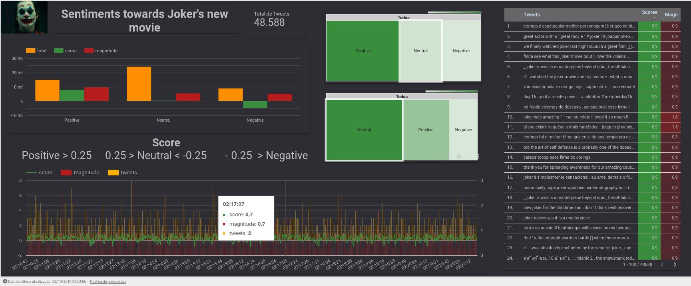

# Sentiments' analyses towards Joker's new movie
> Using tweepy to collect tweets, and google cloud's NLP to analyse the sentiments

![Python Version][py-image]

This project started as a playfull way to understand the process of interacting with Apis, collect data, clean it, use natural language process to label it,
then plot in a way that we can have some conclusions about the data. 
It endend as a program that automatic collect, clean and language process the data.


## Installation
Linux Ubuntu 18.04:

Clone this repository in your machine;

Install [miniconda3][miniconda3] latest version;

Install [mongodb][mongo];

Create a conda's virtual enviroment in your pc;

Install the dependencies;

Create an account on google cloud and twitter's development platform;

At [twitter's development][devtwitt], activate the apikeys, and copy paste on /crendetials;

At [google cloud][googlec], activate the cloud natural language API and create a service account,
	after that, download the .json and paste it on /credentials;
	
Run in your console ``` python3 index.py ``` ;

Choose the robot you want to use;

When the robot is finished run  ``` python3 index.py ``` again and select other robot.

_PS: Not tested on Windows and OS X but it may work. The possible problem could be the os.env at the analyser robot._

## Usage example

You can use this code to make a sentiment analyses towards any new media, a new game, new movie, new series, new product.

I called robot, each part of the program:

    -Manager coordenates the calls;
	
    -Listener is responsable for collecting the tweets;
	
    -Saver is responsable for interacting with mongodb;
	
    -Preprocessor is responsable for cleaning the tweets;
	
    -Analyser is responsable for request google's api;
	
    -Posprocessor is responsable to deliver the final csv.

Feel free to suggest improvements, especially at the preprocessor, cause you will not get only the tweets you want.

In this especific case I used Joker's new movie as an use case.

After the final csv is complete, you can use any tool to plot your data. I choose datastudio from google, cause I found it easy and intuitive to use.

See how beautiful it became =]



_You can interact with the plots [here][datastudio]._


## Development setup

After setting up your enviroment, install the dependencies running:

```sh
conda install $(cat dependencies/conda_dep.txt)
```
then:

```sh
pip install $(cat dependencies/pip_dep.txt)
```

## Meta
Feel free to ask me if you have any doubts or problems with the program =]

Thomas Roquetti – [@ThomasBorgess](https://twitter.com/https://twitter.com/ThomasBorgess) – thomas.mr.borges@gmail.com

Distributed under the MIT license. See ``LICENSE`` for more information.

[https://github.com/ThomasBorges](https://github.com/ThomasBorges)

## Contributing
Please, be free to contribute, I'll appreciate it =]

1. Fork it (<https://github.com/ThomasBorges/joker-project/fork>)
2. Create your feature branch (`git checkout -b feature/fooBar`)
3. Commit your changes (`git commit -am 'Add some fooBar'`)
4. Push to the branch (`git push origin feature/fooBar`)
5. Create a new Pull Request

<!-- Markdown link & img dfn's -->
[py-image]: https://img.shields.io/badge/python-v3.7-blue
[miniconda3]: https://docs.conda.io/en/latest/miniconda.html
[devtwitt]: https://developer.twitter.com/
[googlec]: https://cloud.google.com/
[datastudio]: https://datastudio.google.com/reporting/178c980f-040c-45ea-a77a-407c90f8e068
[mongo]: https://www.mongodb.com/download-center/community
